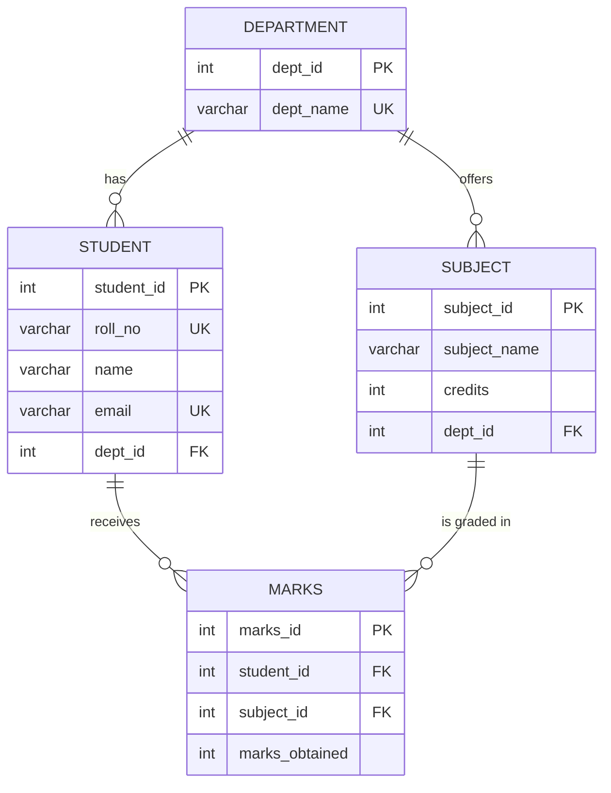
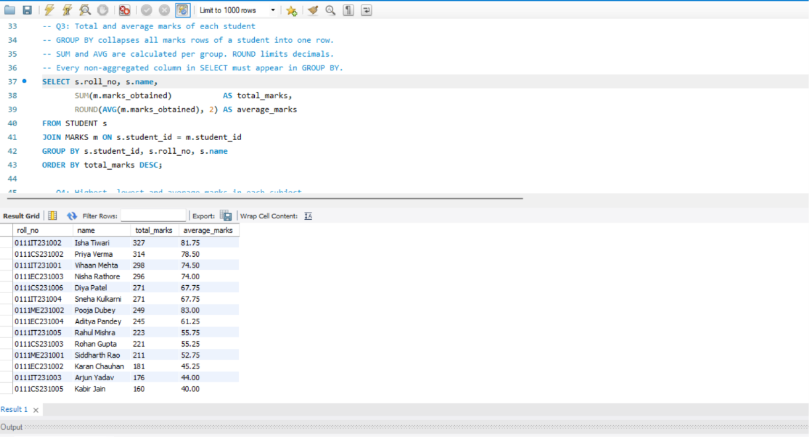
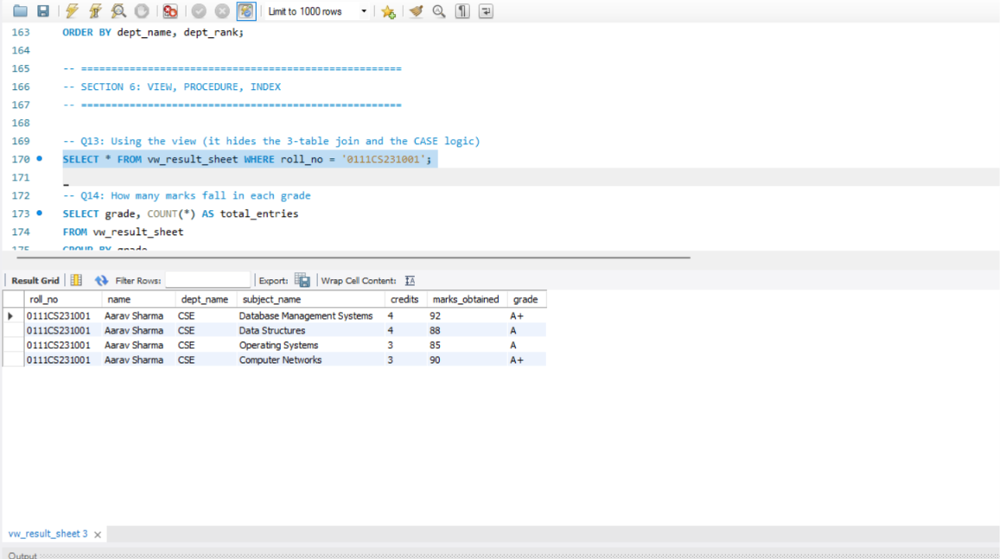

# student-performance-analytics-db

# Student Performance Analytics Database

A MySQL database project that stores student marks and answers questions like *"Who is the topper?"*, *"Who failed?"* and *"Which department has the best average?"*

---

## About the Project

Colleges keep marks of many students in many subjects. If this is stored in one big sheet, the data gets repeated and mistakes happen easily.

In this project I designed a proper database with **4 linked tables**. Then I wrote SQL queries to find totals, averages, toppers, failed students and rank lists.

## What You Can Find Out

- Total and average marks of every student
- Highest, lowest and average marks in each subject
- Number of students in each department
- Students who failed in one or more subjects
- Students who passed every subject
- Students scoring above the overall average
- Students whose marks are not entered yet
- Rank list of all students
- Top 2 students in each department
- Result sheet with grades for any student

## Tools Used

- MySQL 8.0
- MySQL Workbench 8.0 CE
- SQL (joins, GROUP BY, HAVING, subqueries, window functions, views, indexes)
- Git and GitHub

---

## ER Diagram



`PK` = primary key, `FK` = foreign key, `UK` = unique

### How the tables are connected

- One **department** has many **students**.
- One **department** offers many **subjects**.
- One **student** has many **marks** (one for each subject).
- One **subject** has many **marks** (one for each student).
- A student can study many subjects, and a subject can have many students. This is a many-to-many link, so the `MARKS` table sits in the middle and joins them. It is called a **junction table**.

---

## Database Design

Database name: `student_performance_db`

### Tables

**DEPARTMENT**

| Column | Type | Meaning |
|---|---|---|
| dept_id | INT, primary key | Unique id of the department |
| dept_name | VARCHAR(50), unique | CSE, IT, ECE, Mechanical |

**STUDENT**

| Column | Type | Meaning |
|---|---|---|
| student_id | INT, primary key | Unique id of the student |
| roll_no | VARCHAR(50), unique | College roll number |
| name | VARCHAR(100) | Full name |
| email | VARCHAR(100), unique | Email address |
| dept_id | INT, foreign key | Department of the student |

**SUBJECT**

| Column | Type | Meaning |
|---|---|---|
| subject_id | INT, primary key | Unique id of the subject |
| subject_name | VARCHAR(100) | Name of the subject |
| credits | INT | Credit value (1 to 6) |
| dept_id | INT, foreign key | Department offering the subject |

**MARKS**

| Column | Type | Meaning |
|---|---|---|
| marks_id | INT, primary key | Unique id of the entry |
| student_id | INT, foreign key | Which student |
| subject_id | INT, foreign key | Which subject |
| marks_obtained | INT | Marks scored out of 100 |

### Rules used to keep the data correct

- **Primary keys** give every row a unique id.
- **Foreign keys** make sure a student always belongs to a real department, and marks always belong to a real student and subject.
- **UNIQUE** stops duplicate roll numbers, emails and department names.
- **UNIQUE on (student, subject)** in `MARKS` means a student cannot get two marks for the same subject.
- **CHECK** makes sure marks are a valid score out of 100 and credits are between 1 and 6.
- **ON DELETE RESTRICT** stops deleting a department that still has students or subjects.
- **ON DELETE CASCADE** removes a student's marks automatically when that student is deleted.

### Indexes

An index works like the index page of a book. It helps MySQL find rows faster.

| Index | On | Why |
|---|---|---|
| idx_student_name | STUDENT(name) | Faster search by student name |
| idx_marks_subject_marks | MARKS(subject_id, marks_obtained) | Faster highest, lowest and average per subject |

MySQL also creates indexes by itself for primary keys, unique columns and foreign keys.

### View

A view is a saved query that works like a virtual table.

**`vw_result_sheet`** joins `STUDENT`, `DEPARTMENT`, `SUBJECT` and `MARKS` and adds a grade for every mark.

| Marks | Grade |
|---|---|
| 90 and above | A+ |
| 75 to 89 | A |
| 60 to 74 | B |
| 40 to 59 | C |
| Below 40 | FAIL |

The grade is not stored in any table. It is worked out when the view is read, so it can never go out of date.

---

## Sample Data

| Table | Rows |
|---|---|
| DEPARTMENT | 4 |
| STUDENT | 18 |
| SUBJECT | 6 |
| MARKS | 67 |

The data is made on purpose to test every query: some toppers, some failed students, two students with the same total (a tie), and one student with no marks.

---

## Files in this Repository

```
├── schema.sql        # creates the database, tables, indexes and view
├── data.sql          # inserts the sample data
├── queries.sql       # all the SQL queries
├── screenshots/      # output screenshots
└── README.md
```

## How to Run

1. Install **MySQL Server** and **MySQL Workbench**.
2. Open Workbench and connect to your local MySQL.
3. Open `schema.sql` (File, then Open SQL Script) and run it with the first lightning bolt button.
4. Open `data.sql` and run it.
5. Open `queries.sql` and run the queries one by one (select a query and press Ctrl + Enter).

Always run the files in this order: **schema, then data, then queries.**

---

## All Queries

| No. | What it finds | SQL concept used |
|---|---|---|
| Q1 | All students with their department | INNER JOIN, ORDER BY |
| Q2 | All marks of one student | 3-table JOIN, WHERE |
| Q3 | Total and average marks of each student | SUM, AVG, GROUP BY |
| Q4 | Highest, lowest, average marks per subject | MAX, MIN, AVG, GROUP BY |
| Q5 | Number of students in each department | LEFT JOIN, COUNT |
| Q6 | Departments with average above 65 | GROUP BY with HAVING |
| Q7 | Students who failed at least one subject | WHERE, DISTINCT |
| Q8 | Students who passed every subject | HAVING with MIN |
| Q9 | Students above the overall average | Subquery |
| Q10 | Students with no marks entered | LEFT JOIN with IS NULL |
| Q11 | Rank list of all students | RANK, DENSE_RANK, CTE |
| Q12 | Top 2 students in each department | PARTITION BY, CTE |
| Q13 | Result sheet of one student | View |
| Q14 | Number of marks in each grade | View with GROUP BY |

---

## Sample Queries and Output

### Total and average marks of each student (Q3)

```sql
SELECT s.roll_no, s.name,
       SUM(m.marks_obtained)           AS total_marks,
       ROUND(AVG(m.marks_obtained), 2) AS average_marks
FROM STUDENT s
JOIN MARKS m ON s.student_id = m.student_id
GROUP BY s.student_id, s.roll_no, s.name
ORDER BY total_marks DESC;
```

`GROUP BY` joins all marks of one student into a single row, so `SUM` and `AVG` are calculated for each student.



### Students with no marks entered (Q10)

```sql
SELECT s.roll_no, s.name
FROM STUDENT s
LEFT JOIN MARKS m ON s.student_id = m.student_id
WHERE m.student_id IS NULL;
```

`LEFT JOIN` keeps every student. If a student has no marks, the marks columns come back as `NULL`, and `IS NULL` finds that student.



### Result sheet using the view (Q13)

```sql
SELECT * FROM vw_result_sheet WHERE roll_no = '0111CS231001';
```

The view hides the joins and the grade logic, so one short query gives the full result.


### Rank list of all students (Q11)

```sql
WITH student_totals AS (
    SELECT s.student_id, s.roll_no, s.name,
           SUM(m.marks_obtained) AS total_marks
    FROM STUDENT s
    JOIN MARKS m ON s.student_id = m.student_id
    GROUP BY s.student_id, s.roll_no, s.name
)
SELECT RANK()       OVER (ORDER BY total_marks DESC) AS student_rank,
       DENSE_RANK() OVER (ORDER BY total_marks DESC) AS dense_position,
       name, total_marks
FROM student_totals;
```

First the total of each student is found. Then the window functions give ranks. When two students have the same total, `RANK()` skips the next number (1, 2, 2, 4) and `DENSE_RANK()` does not (1, 2, 2, 3).

---

## What I Learned

- How to design tables from an ER diagram and keep the data in 3NF
- Using primary keys, foreign keys, UNIQUE and CHECK to protect the data
- Writing joins on 2 to 3 tables
- The difference between `WHERE` and `HAVING`
- Writing subqueries and using `LEFT JOIN` to find missing records
- Ranking with window functions (`RANK`, `DENSE_RANK`, `PARTITION BY`)
- Using views to make complex queries simple
- How indexes make searching faster

## Author

**Saumyaa Agrawal**
B.Tech in Computer Engineering with Cyber Security, LNCTS (RGPV)
GitHub: [saumyaa2802](https://github.com/saumyaa2802)